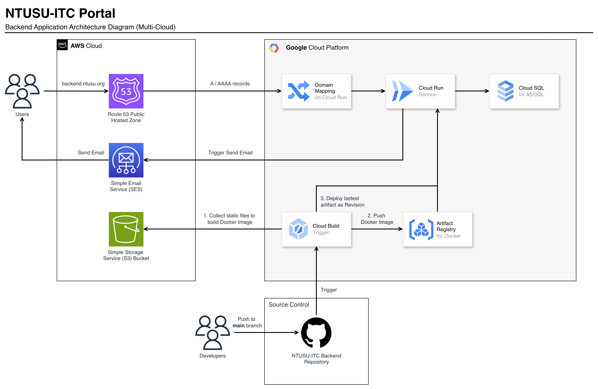

<div align="center">
  
  <h1>NTUSU ITC Backend</h1>
  <p style="font-size:16px;font-weight:normal;">Backend repository for NTUSU ITC Portal</p>
</div>

<div align="center">
<p align="center">
<a href="#introduction">Introduction</a> &nbsp;&bull;&nbsp;
<a href="#system-overview">System Overview</a> &nbsp;&bull;&nbsp;
<a href="#getting-started">Getting Started</a> &nbsp;&bull;&nbsp;
<a href="#production-deployment">Production Deployment</a> &nbsp;&bull;&nbsp;
<a href="#feature-modules">Feature Modules</a>
</p>
</div>


## Introduction

NTUSU ITC Backend is the server-side application powering the NTUSU ITC Portal. Built with Django REST Framework, it provides APIs and core business logic for modules such as authentication, ULocker, events, and other student-facing services.

This repository supports both **local development** and **production deployment**, with a containerised development workflow and a cloud-based production architecture spanning **Google Cloud Platform** and **AWS**. 

The project is currently maintained by the **NTUSU ITC team**.


## System Overview

### System Architecture



The application is deployed as a containerised backend service on **Google Cloud Run**. Production traffic is routed through **Amazon Route 53** to **Cloud Run** via custom **Domain Mapping**, while backend data is stored in **Google Cloud SQL for MySQL**. Outbound email functionality is handled through **Amazon SES**.

A **Cloud Build** pipeline is connected to this GitHub repository to automate image builds and deployments to **Google Artifact Registry** and **Cloud Run**. Static files are located in **Amazon S3** and are retrieved during the Docker image build process.

### Tech Stack

 &nbsp; 
  

 &nbsp; 

 &nbsp;  

 &nbsp; 


## Getting Started

This section will guide you through setting up the project locally to begin contributing to development!

### Pre-requisites

- Docker Desktop ([MacOS](https://docs.docker.com/desktop/install/mac-install/) / [Windows](https://docs.docker.com/desktop/install/windows-install/) / [Linux](https://docs.docker.com/desktop/install/linux-install/)) - for consistent development environment
- [Python 3](https://www.python.org/downloads/) - for virtual environment setup and local development
- (Optional) [MySQL Workbench](https://dev.mysql.com/downloads/workbench/) - for easier management of the database

### 1. Clone this repository

Clone this repository and change your current directory to the root of the project, where the file, `docker-compose.yml`, is located:

```powershell
git clone https://github.com/callmegerlad/ntusu-itc-backend.git
cd ntusu-itc-backend
```

### 2. Build and run application using Docker

Build the images and start the containers with the command:

```powershell
docker-compose up --build
```

> 📝 Note: To stop the application, press `CTRL` + `C` in the terminal!

Your application should now be running at http://localhost:8888/.

### 3. Perform database migration

Using another terminal, execute the following command:

```powershell
docker exec -ti SUITC_Backend python manage.py migrate
```

You should perform this command when:
- setting up the development environment for the first time, or
- there are new migration files added.

### 4. Load sample data

Sample data are generated using Django Fixtures. It is used to populate your database (stored in Docker Volumes):

```powershell
docker exec -ti SUITC_Backend python manage.py loaddata sample_user
```

Running this command will create a superuser account with the following credentials:
- Username: `superuser`
- Password: `123` 

Other sample data can be seen on the fixtures folder (password for other sample user: 1048576#).

> ⚠️ Warning: Running this command may overwrite some existing data!

### 5. Set up development environment

To start development, we will create a virtual environment on our local machine:

```powershell
python3 -m venv venv
```

To activate the virtual environment we just created, follow the instructions for your respective operating system below:

#### Unix-based Systems (e.g. Linux, macOS)

Use the `source` command:

```powershell
source venv/bin/activate
```

#### Windows

In Command Prompt:

```cmd
venv\Scripts\activate.bat
```

In PowerShell:

```powershell
venv\Scripts\Activate.ps1
```

#### (DONT RUN THIS YET) Deactivate the Virtual Environment

```powershell
deactivate
```

### 6. Install packages in Virtual Environment

Finally, install all required dependencies in our newly created virtual environment to finish setting up our local machine for development!

```powershell
pip install -r requirements.txt
```

### Troubleshoot

This section is to document any problems that might occur when running the development environment along with its solution, as we all are using different devices which might have slightly different behaviour.

- Note: For M-series chip MacBooks, you must execute the following:

```powershell
softwareupdate --install-rosetta
export DOCKER_DEFAULT_PLATFORM=linux/amd64
```

### Executing Utility Commands

In order for you to execute other `manage.py` utility commands through Docker container, just add `docker exec -ti SUITC_Backend` (add `sudo` if you're using MAC) in front of your command. Please ensure that the server is indeed running, open another terminal if needed.

For example, to create new migrations you can run:

```powershell
docker exec -ti SUITC_Backend python manage.py makemigrations
```

### Testing

Everytime you add new features, please create the appropriate test cases. You can run this command to run all test cases in the project:

```powershell
docker exec -ti SUITC_Backend python manage.py test
```

Automatic CI testing is enforced everytime a pull request or a push is done to the main branch.

### API Documentation

There are 2 types of documentation provided here:

- Automatic Documentation using Swagger UI

- Manual Documentation in the `docs` app by writing markdown files (stored locally in this repository) (NOTE: this is not available in the live environment yet)

See some of the manual documentations here:

- [Index Swapper](/docs/api-guide/index%20swapper.md)


## Production Deployment

Production is deployed to Google Cloud Run through Cloud Build, as configured through `cloudbuild.yaml`.

### Deployment flow

1. Build image using `docker/prod/Dockerfile`, retrieving static files from S3
2. Push image to Artifact Registry
3. Deploy the latest artifact from Artifact Registry to Cloud Run as a revision

### Required environment variables

The following environment variables are necessary for production deployment, to be configured in **Cloud Run**:

- `PROD` = `1`
- `PROD_HOST`
- `DB_NAME`, `DB_USER`, `DB_PASSWORD`, `DB_HOST`
- `AWS_ACCESS_KEY_ID`, `AWS_SECRET_ACCESS_KEY`, `AWS_STORAGE_BUCKET_NAME`, `EVENTS_CSV_BUCKET_NAME`
- `S3_ACCESS_KEY_ID`, `S3_SECRET_ACCESS_KEY`
- `SES_ACCESS_KEY_ID`, `SES_SECRET_ACCESS_KEY`

> 📝 Note: Sensitive values should be stored securely using **Google Secret Manager**!


## Feature Modules

### Docs
Hosts the manual API documentation, written as Markdown files and served through the backend. An alternative to the auto-generated Swagger UI for human-readable endpoint guides.

### Event
Event management and check-in system for NTUSU internal events. Supports creating and managing events with configurable **access rules** (e.g. allow non-undergraduates or exchange students), auto start/end based on scheduled times, **event officers** with token-based mobile check-in, and **matric number check-in** tracking.

### Portal
General-purpose portal APIs. Manages **update notes** (changelog entries shown to users) and a **feedback form** system that supports bug reports, feature requests, improvement suggestions, and ITC recruitment enquiries.

### SSO
Authentication and user identity layer for the entire backend. Implements a **custom Django user model** with email-based login, JWT access/refresh token authentication, and a custom token mechanism for password reset and email verification flows.

### ULocker
Student locker booking and management system. Models **locations**, individual **lockers**, and **bookings** with allocation status tracking. Includes admin configuration, QR code generation support, and a `ULockerAdmin` role for managing the system.

### ~~Deprecated Modules~~

These apps remain in the codebase for historical reference but are no longer actively maintained or exposed in production:

> UFacility, Inventory, Indexswapper, StarsWar, Workshop, Communication, Games, UShop
